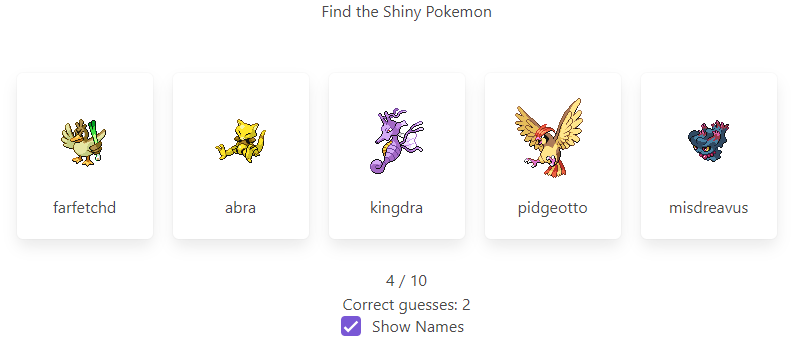

# Pokemon Shiny Guesser

[](https://app.netlify.com/sites/boring-curran-e4ae5e/deploys)

A web application that tests users on their Pokemon knowledge by allowing them to guess which pokemon is shiny from a lineup. Uses the [PokeAPI](https://pokeapi.co/) to grab sprites and other information.

For those not familiar with Pokemon, a shiny pokemon is a rare variant with different coloration. In the video games the chances of finding this "shiny" variation is about 0.012%.

## Purpose & Reflection

I built this web app to explore the [Vue.js](https://vuejs.org/) framework and practice my Javascript skills. 

Although the main functionality of the site works, there are still some things I would like to add such as a timer for each round and a history of a user's attempts. 

One of the more difficult problems I encountered was determining how to load the pokemon sprites and when to make the API call to get the sprite and pokemon information. 

Right now I am making an API call when the game starts to get information for the 50 pokemon I need to show (10 rounds with 5 pokemon to guess each round) and storing this in a variable. I had considered storing the sprites on the client's machine but that seemed a litle irresponsible with the client's storage so I am currently making HTTP requests for the sprites each round. This works but user's with slower internet connections may experience slow loading times. 

## Screen Shots


## Running the site locally
```
npm install
```

### Compiles and hot-reloads for development
```
npm run serve
```

### Compiles and minifies for production
```
npm run build
```